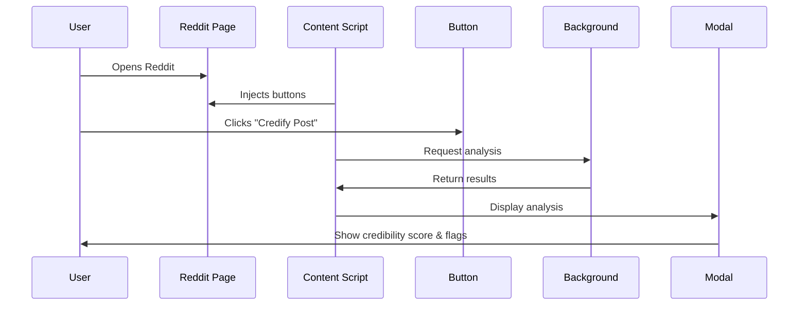

# Credify

A Chrome browser extension that analyzes the credibility of Reddit posts in real-time, helping users identify potentially misleading or unverified content.


## Overview

Credify is a misinformation checker for Reddit that automatically injects credibility analysis buttons into Reddit posts. When clicked, it provides users with a credibility score, detected flags, and detailed analysis to help them make informed decisions about the content they're viewing.

## Features

- **Automatic Button Injection**: Dynamically adds "Credify Post" buttons to Reddit posts using MutationObserver
- **Real-time Analysis**: Provides instant credibility scoring on a 10-point scale
- **Flag Detection**: Identifies potential issues such as unverified sources and disputed claims
- **Beautiful UI**: Modern, responsive modal interface with smooth animations
- **Post Tracking**: Prevents duplicate buttons and caches analysis results
- **Multi-context Support**: Works on both Reddit feeds and individual post pages
- **Shadow DOM Compatibility**: Handles Reddit's complex DOM structure including shadow roots

## Installation

### For Development

1. Clone this repository:
```bash
git clone https://github.com/yourusername/MutationObserve.git
cd MutationObserve
```

2. Open Chrome and navigate to `chrome://extensions/`

3. Enable "Developer mode" (toggle in the top-right corner)

4. Click "Load unpacked" and select the project directory

5. The Credify icon should appear in your Chrome toolbar

### For Users

_Note: This extension is currently in development and not yet published to the Chrome Web Store._

## Usage

1. **Navigate to Reddit**: Visit any Reddit page (e.g., https://reddit.com/r/all)

2. **Look for the Button**: Credify automatically injects "🔍 Credify Post" buttons on Reddit posts

3. **Click to Analyze**: Click the button on any post to analyze its credibility

4. **View Results**: A modal will appear showing:
   - Credibility score (0-10)
   - Visual score indicator with color coding
   - Post details (title, ID, subreddit)
   - Detected flags and warnings (if any)

5. **Use the Popup**: Click the Credify icon in your toolbar to see information about the current post

## How It Works

### Architecture

The extension consists of three main components:

1. **Content Script** (`contentScript.js`)
   - Runs directly on Reddit pages
   - Uses MutationObserver to detect new posts
   - Extracts post metadata (ID, title, subreddit)
   - Injects credibility check buttons
   - Handles button interactions

2. **Background Service Worker** (`background.js`)
   - Monitors tab navigation
   - Coordinates communication between components
   - Stores analysis results in Chrome's local storage

3. **Credibility Modal** (`credibilityModal.js`)
   - Manages the UI for displaying analysis results
   - Provides loading states and animations
   - Handles modal interactions (close, keyboard shortcuts)

### Analysis Process



## Project Structure

```
MutationObserve/
├── assets/
│   ├── check.png           # Icon asset
│   ├── credify-icon.png    # Extension icon
│   └── start-button.png    # Button asset
├── background.js           # Background service worker
├── contentScript.js        # Main content injection logic
├── credibilityModal.js     # Modal UI component
├── manifest.json           # Extension configuration
├── popup.html              # Extension popup UI
├── popup.js                # Popup logic
├── LICENSE                 # MIT License
└── README.md              # This file
```

## Technologies Used

- **JavaScript (ES6+)**: Core programming language
- **Chrome Extension API**: Browser integration
  - `chrome.storage`: Local data persistence
  - `chrome.tabs`: Tab management
  - `chrome.runtime`: Message passing
- **MutationObserver API**: DOM change detection
- **Shadow DOM Handling**: Reddit's modern web component architecture
- **CSS3**: Styling and animations

## Configuration

The extension is configured through `manifest.json`:

```json
{
  "name": "Credify",
  "version": "0.1.0",
  "manifest_version": 3,
  "permissions": ["storage", "tabs", "activeTab"],
  "host_permissions": ["https://*.reddit.com/*"]
}
```

## Development

### Key Functions

#### Content Script
- `analyzePost(postId, subreddit, postTitle)`: Performs credibility analysis
- `injectButtonForPost(postId)`: Adds button to specific post
- `findPostElementById(postId)`: Locates post in DOM
- `getPostTitle(postId)`: Extracts post title using multiple strategies
- `createCredibilityButton(postId)`: Creates styled button element

#### Debugging Utilities
The extension includes helper functions accessible via the browser console:
- `window.inspectRedditDOM()`: Analyzes Reddit's DOM structure
- `window.cleanupDuplicateButtons()`: Removes duplicate button instances

### Future Enhancements

- [ ] Integrate with real credibility API/ML model
- [ ] Add user customization options (themes, sensitivity settings)
- [ ] Implement caching strategy for better performance
- [ ] Add support for other social media platforms
- [ ] Provide detailed source citations
- [ ] Include user reporting mechanism
- [ ] Add browser sync for settings across devices
- [ ] Implement rate limiting and API optimization

## Browser Compatibility

Currently tested and supported:
- ✅ Google Chrome (Manifest V3)
- ✅ Microsoft Edge (Chromium-based)

Planned support:
- 🔄 Firefox (requires Manifest V2 or V3 adaptation)
- 🔄 Safari (requires separate implementation)

## Privacy

Credify respects your privacy:
- No personal data collection
- Analysis performed locally (mock data currently)
- No external API calls in current version
- Chrome storage used only for caching analysis results
- No tracking or analytics

## Contributing

Contributions are welcome! Please feel free to submit a Pull Request.

1. Fork the repository
2. Create your feature branch (`git checkout -b feature/AmazingFeature`)
3. Commit your changes (`git commit -m 'Add some AmazingFeature'`)
4. Push to the branch (`git push origin feature/AmazingFeature`)
5. Open a Pull Request

## License

This project is licensed under the MIT License - see the [LICENSE](LICENSE) file for details.

## Acknowledgments

- Built with Chrome Extension Manifest V3
- Designed for Reddit's modern web architecture
- Inspired by the need for better information verification tools

## Contact

For questions, suggestions, or issues, please open an issue on GitHub.

---

**Note**: This extension currently uses mock data for demonstration purposes. Integration with a real credibility analysis API is planned for future releases.

